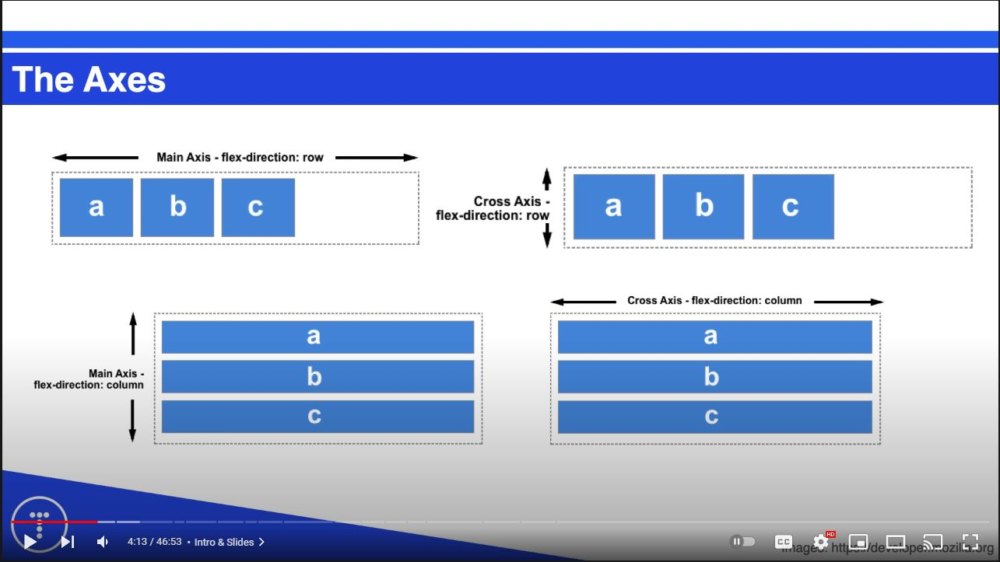

 # Flex

 ## Flex Container
 Is the element that holds flex items. Container is created with display:flex; 

 ### Flex Container Properties
 * Flex-direction - Changes direction of flex from a row to a column (flex-direction: column;) :row-reverse; reverses the order of our row
 * justify-content: end/start/center/space-around/space-between; - Pertains to the main axis. SA puts space on the start/end and in between. SB doesnt put space on start/end and all the space goes in between.
 * align-items: end/start/center -> Pertains to the cross axis. This'll change the vertical alignment (cross axis of a flex row)

 ## Flex items
 Are direct children of flex containers. These children are put into a horizontal row when display flex is used.

 Items and containers each have their own properties.

 An item can be a flex container as well
 
 ## Flex item properties
 * align-self: start/end/center -> Used on a flex item, we can target flex items more specifically

## The Axes

The main axis for a row is horizontal. Cross axis is the vertical.

The main axis for a column is vertical. Cross axis is horizontal.

# Random
.item*3{Item $} -> will create 3 divs with the text inside of item and the $ will be replaced with the numbers